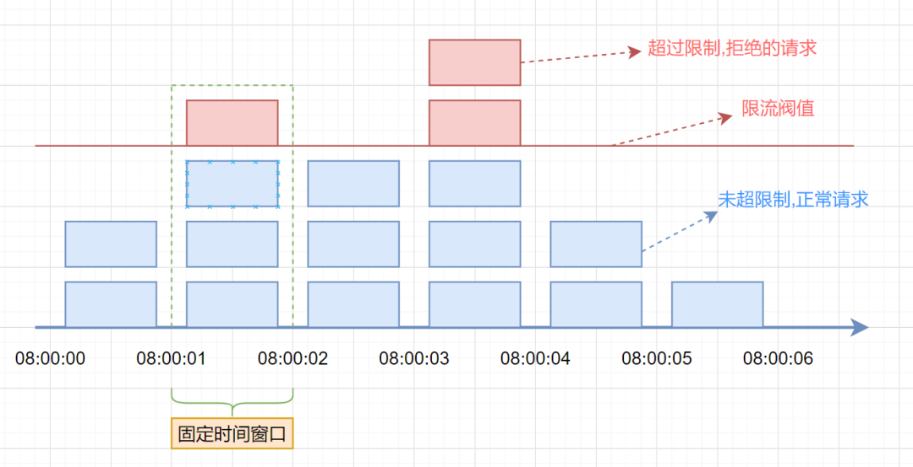
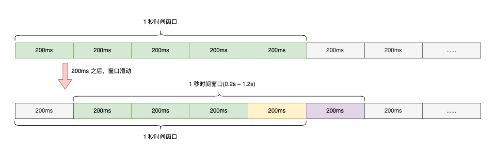
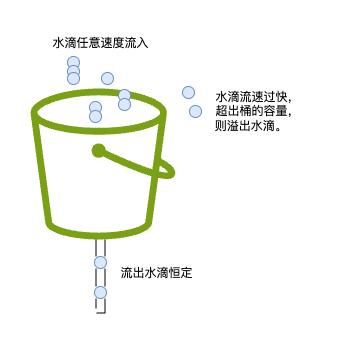
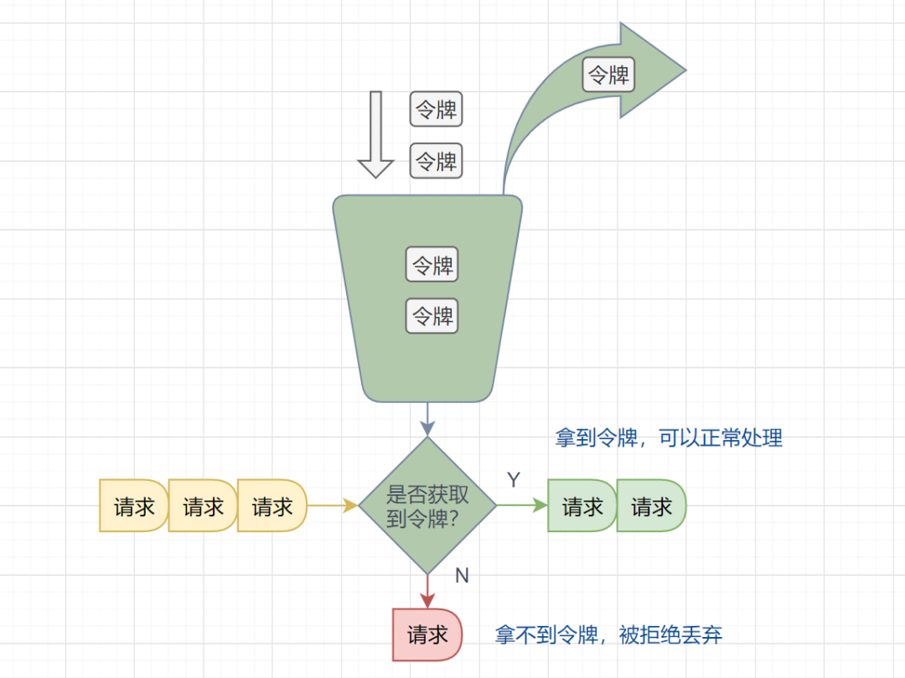

## 前言

最近几年，随着微服务的流行，服务和服务之间的依赖越来越强，调用关系越来越复杂，服务和服务之间的稳定性越来越重要。在遇到突发的请求量激增，恶意的用户访问，亦或请求频率过高给下游服务带来较大压力时，我们常常需要通过缓存、限流、熔断降级、负载均衡等多种方式保证服务的稳定性。其中限流是不可或缺的一环，这篇文章介绍限流相关知识。

## 什么是限流

**限流**顾名思义，就是对请求或并发数进行限制；通过对一个时间窗口内的请求量进行限制来保障系统的正常运行。如果我们的服务资源有限、处理能力有限，就需要对调用我们服务的上游请求进行限制，以防止自身服务由于资源耗尽而停止服务。

在限流中有两个概念需要了解：

- **阈值**：在一个单位时间内允许的请求量。如 QPS 限制为10，说明 1 秒内最多接受 10 次请求。
- **拒绝策略**：超过阈值的请求的拒绝策略，常见的拒绝策略有直接拒绝、排队等待等。

> **限流和熔断有什么区别？**
>
> 限流发生在流量进来之前，超过的流量进行限制。
>
> 熔断是一种应对故障的机制，发生在流量进来之后，如果系统发生故障或者异常，熔断会自动切断请求，防止故障进一步扩展，导致服务雪崩。

> **限流和削峰有什么区别？**
>
> 削峰是对流量的平滑处理，通过缓慢地增加请求的处理速率来避免系统瞬时过载。
>
> 削峰大概就是水库，把流量储存起来，慢慢流，限流大概就是闸口，拒绝超出的流量。

## 限流的通用流程

那么具体限流怎么实现呢？可以概括为以下几个步骤：


1. **统计请求流量**：记录请求的数量或速率，可以通过计数器、滑动窗口等方式进行统计。
2. **判断是否超过限制**：根据设定的限制条件，判断当前请求流量是否超过限制。
3. **执行限流策略**：如果请求流量超过限制，执行限流策略，如拒绝请求、延迟处理、返回错误信息等。
4. **更新统计信息**：根据请求的处理结果，更新统计信息，如增加计数器的值、更新滑动窗口的数据等。
5. **重复执行以上步骤**：不断地统计请求流量、判断是否超过限制、执行限流策略、更新统计信息

*当然具体的限流算法实现可能会根据不同的场景和需求进行调整和优化，比如使用令牌桶算法、漏桶算法等。*

## 单机限流与分布式限流

我们注意到，在限流的通用流程里，需要统计请求量、更新统计量，那么这个请求量的统计和更新就必须维护在一个存储里。假如只是一个单机版的环境，那就很好办了，直接储存到本地。但是一般来讲，我们的服务都是集群部署的，如何来实现多台机器之间整体的限流呢？

这时候就可以把我们的统计信息放到 Tair 或 Redis 等分布式的 K-V 存储中。

## 单机限流

### 1. 固定窗口限流算法

#### 1.1 什么是固定窗口限流算法

> **固定窗口算法**又叫**计数器算法**，是一种**简单**方便的限流算法。其原理是在**固定时间窗口**(`单位时间`)内限制请求的数量。该算法将时间分成固定的窗口，并在每个窗口内限制请求的数量。具体来说，算法将请求按照时间顺序放入时间窗口中，并计算该时间窗口内的请求数量，如果请求数量超出了限制，则拒绝该请求。

假设单位时间(固定时间窗口)是`1`秒，限流阀值为`3`。在单位时间`1`秒内，每来一个请求,计数器就加`1`，如果计数器累加的次数超过限流阀值`3`，后续的请求全部拒绝。等到`1s`结束后，计数器清`0`，重新开始计数。如下图：



#### 1.2 固定窗口限流伪代码

```java
public Long lastAcquireTime = 0L; // 上一次获取时间
public Long windowUnit = 1000L; // 固定时间窗口是1000ms
public Integer threshold = 10; // 窗口阀值是10
public AtomicInteger atomicCount = new AtomicInteger(0); // 统计请求数

/**
 * 固定窗口限流算法
 * @return true: 未达到阈值不限流，false：以达到阈值范围准备限流
 */
public synchronized boolean tryAcquire() {
  long now = System.currentTimeMillis(); // 获取当前时间
  if (now - lastAcquireTime > windowUnit) { // 检查是否在时间窗口内
      atomicCount.set(0); // 计数器清0
      lastAcquireTime = now; // 开启新的时间窗口
  }
  if (atomicCount.get() < threshold) { // 小于阀值
      atomicCount.incrementAndGet(); // 计数统计器加1
      return true;
  }
  return false;
}
```

#### 1.3 优缺点

- **优点**：固定窗口算法非常简单，易于实现和理解。
- **缺点**：存在**明显的临界问题**，比如: 假设限流阀值为`5`个请求，单位时间窗口是`1s`,如果我们在单位时间内的`前0.8-1s`和`1-1.2s`，分别并发5个请求。虽然都没有超过阀值，但是如果算0.8-1.2s,则并发数高达10，**已经超过单位时间1s不超过5阀值的定义**啦。


### 2. 滑动窗口限流算法

#### 2.1 什么是滑动窗口限流算法

> 滑动窗口限流算法是一种常用的限流算法，用于控制系统对外提供服务的速率，防止系统被过多的请求压垮。它将单位时间周期分为`n`个小周期，分别记录每个小周期内接口的访问次数，并且根据时间滑动删除过期的小周期。**它可以解决固定窗口临界值的问题**。



假设单位时间还是`1`s，滑动窗口算法把它划分为`5`个小周期，也就是滑动窗口（**单位时间**）被划分为`5`个小格子。每格表示`0.2s`。每过`0.2s`，时间窗口就会往右滑动一格。然后呢，每个小周期，都有自己独立的计数器，如果请求是`0.83s`到达的，`0.8~1.0s`对应的计数器就会加`1`。

**我们来看下，滑动窗口,去解决固定窗口限流算法的临界问题，思想是怎样**

> 假设我们`1s`内的限流阀值还是`5`个请求，`0.8~1.0s`内（比如`0.9s`的时候）来了`5`个请求，落在黄色格子里。时间过了`1.0s`这个点之后，又来`5`个请求，落在紫色格子里。如果是固定窗口算法，是不会被限流的，但是滑动窗口的话，每过一个小周期，它会右移一个小格。过了`1.0s`这个点后，会右移一小格，当前的单位时间段是`0.2~1.2s`，这个区域的请求已经超过限定的`5`了，已触发限流啦，实际上，紫色格子的请求都被拒绝啦。

当滑动窗口的**格子周期划分的越多，那么滑动窗口的滚动就越平滑，限流的统计就会越精确**。

#### 2.2 滑动窗口限流算法伪代码

```java
private final Long subCycle = 10; // 单位时间划分的小周期（单位：S）
private final Integer permitsPerMinute = 100; // 每分钟限流请求数
// 计数器, k-为当前窗口的开始时间值秒，value为当前窗口的计数
private final TreeMap<Long, Integer> counters = new TreeMap<>();

/**
 * 滑动窗口时间算法实现
 * @return true: 未达到阈值不限流，false：以达到阈值范围准备限流
 */
public synchronized boolean tryAcquire() {
    // 获取当前时间在哪个小周期窗口
    long currentWindowTime = LocalDateTime.now().toEpochSecond(ZoneOffset.UTC) / subCycle * subCycle;
    // 当前窗口总请求数
    Integer currentWindowNum = countCurrentWindow(currentWindowTime);
    // 超过阀值限流
    if (currentWindowNum >= permitsPerMinute) {
        return false;
    }
    // 计数器+1
    counters.merge(currentWindowTime, 1, Integer::sum);
    return true;
}

/**
 * 获取当前窗口中的所有请求数（并删除所有无效的子窗口计数器）
 * @param currentWindowTime 当前子窗口时间
 * @return 当前窗口中的计数
 */
private Integer countCurrentWindow(Long currentWindowTime) {
    // 窗口总大小（单位：S）
    Long windowSize = 60L;
    // 计算窗口开始位置
    Long startTime = currentWindowTime - subCycle * (windowSize / subCycle - 1);
    int count = 0;
    // 遍历当前存储的计数器，删除无效的子窗口计数器，并累加当前窗口中的所有计数器之和
    Iterator<Map.Entry<Long, Integer>> iterator = counters.entrySet().iterator();
    while (iterator.hasNext()) {
        Map.Entry<Long, Integer> entry = iterator.next();
        // 删除无效过期的子窗口计数器
        if (entry.getKey() < startTime) {
            iterator.remove();
        } else {
            // 累加当前窗口的所有计数器之和
            count += entry.getValue();
        }
    }
    return count;
}
```

#### 2.3 滑动窗口限流算法的优缺点

**优点**：

- 简单易懂
- 精度高（通过调整时间窗口的大小来实现不同的限流效果）
- 可扩展性强（可以非常容易地与其他限流算法结合使用）

**缺点**：

- 突发流量无法处理（**无法应对短时间内的大量请求，但是一旦到达限流后，请求都会直接暴力被拒绝。酱紫我们会损失一部分请求，这其实对于产品来说，并不太友好**），需要合理调整时间窗口大小。

### 3. 漏桶限流算法

#### 3.1 什么是漏桶限流算法

漏桶限流算法是一种流量控制算法，用于控制流入网络的数据速率，以防止网络拥塞。它的思想是将数据包看作是水滴，漏桶看作是一个固定容量的水桶，数据包像水滴一样从桶的顶部流入桶中，并通过桶底的一个小孔以一定的速度流出，从而限制了数据包的流量。

> 漏桶限流算法的基本工作原理是：对于每个到来的数据包，都将其加入到漏桶中，并检查漏桶中当前的水量是否超过了漏桶的容量。如果超过了容量，就将多余的数据包丢弃。如果漏桶中还有水，就以一定的速率从桶底输出数据包，保证输出的速率不超过预设的速率，从而达到限流的目的。



- 流入的水滴，可以看作是访问系统的请求，这个流入速率是不确定的。
- 桶的容量一般表示系统所能处理的请求数。
- 如果桶的容量满了，就达到限流的阀值，就会丢弃水滴（拒绝请求）
- 流出的水滴，是恒定过滤的，对应服务按照固定的速率处理请求。

#### 3.2 漏桶限流算法伪代码

```java
public class LeakyBucketSingleRateLimiter {
  private final Long capacity; // 桶的容量
  private final Long rate; // 漏桶出水速率（单位：个/s）
  private AtomicLong water; // 当前桶中的水量
  private Long lastLeakTimestamp; // 上次漏水时间戳（单位：ms）

  /**
   * @param capacity 桶的容量
   * @param rate 漏桶出水速率
   */
  public LeakyBucketSingleRateLimiter(Long capacity, Long rate) {
      this.capacity = capacity;
      this.rate = rate;
      this.water = new AtomicLong(0L);
      this.lastLeakTimestamp = System.currentTimeMillis();
  }

  /**
   * 方法用于尝试向桶中放入一定量的水。
   * @param waterRequested 待进水量
   * @return 如果桶中还有足够的空间返回 false，否则返回 true。
   */
  public synchronized boolean tryConsume(Long waterRequested) {
      leak();
      // 计算桶中水量+待进水量是否超出桶总容量
      if (water.get() + waterRequested <= capacity) {
          // 没有超出
          water.addAndGet(waterRequested);
          return false;
      }
      // 超出了
      return true;
  }

  /**
   * 方法用于漏水，根据当前时间和上次漏水时间戳计算出应该漏出的水量，然后更新桶中的水量和漏水时间戳等状态。
   */
  private void leak() {
      // 获取当前时间
      Long now = System.currentTimeMillis();
      // 计算当前时间与上一次时间的时差（秒）
      Long elapsedTime = (now - lastLeakTimestamp) / 1000;
      // 露出的水量
      Long leakedWater = elapsedTime * rate;
      if (leakedWater > 0) {
          water = new AtomicLong(Math.max(0, water.get() - leakedWater));
          lastLeakTimestamp = now;
      }
  }
}
```

- 注意:  `tryConsume() `和 `leak() `方法中，都需要对桶的状态进行同步，以保证线程安全性。

#### 3.3 漏桶限流算法的优缺点

**优点**

- 可以平滑限制请求的处理速度，避免瞬间请求过多导致系统崩溃或者雪崩。
- 可以控制请求的处理速度，使得系统可以适应不同的流量需求，避免过载或者过度闲置。
- 可以通过调整桶的大小和漏出速率来满足不同的限流需求，可以灵活地适应不同的场景。

**缺点**

- 需要对请求进行缓存，会增加服务器的内存消耗。
- 对于流量波动比较大的场景，需要较为灵活的参数配置才能达到较好的效果。
- 但是面对突发流量的时候，漏桶算法还是循规蹈矩地处理请求，这不是我们想看到的啦。流量变突发时，我们肯定希望系统尽量快点处理请求，提升用户体验嘛。

### 4. 令牌桶限流算法

#### 4.1 什么是令牌桶限流算法

> 令牌桶算法是**一种常用的限流算法**，可以用于限制单位时间内请求的数量。该算法维护一个固定容量的令牌桶，每秒钟会向令牌桶中放入一定数量的令牌。当有请求到来时，如果令牌桶中有足够的令牌，则请求被允许通过并从令牌桶中消耗一个令牌，否则请求被拒绝。



#### 4.2 令牌桶限流算法伪代码

```java
public class TokenBucketSingleRateLimiter {
  
    private final Long capacity; //令牌桶容量
    private final Long rate; //令牌生成速率，单位：令牌/秒
    private AtomicLong tokens; // 当前桶中令牌数量
    private Long lastRefillTimestamp; // 上次令牌生成时间戳

    /**
     * 构造函数中传入令牌桶的容量和令牌生成速率。
     * @param capacity 令牌桶容量
     * @param rate 令牌生成速率，单位：令牌/秒
     */
    public TokenBucketSingleRateLimiter(Long capacity, Long rate) {
        this.capacity = capacity;
        this.rate = rate;
        this.tokens = new AtomicLong(capacity);
        this.lastRefillTimestamp = System.currentTimeMillis();
    }

    /**
     * 方法表示一个请求是否允许通过，该方法使用 synchronized 关键字进行同步，以保证线程安全。
     * @return 桶中还有令牌返回false 否在返回true
     */
    public synchronized boolean tryAcquire() {
        refill();
        if (tokens.get() > 0) {
            tokens.decrementAndGet();
            return false;
        }
        return true;
    }

    /**
     * 方法用于生成令牌，其中计算令牌数量的逻辑是按照令牌生成速率每秒钟生成一定数量的令牌，
     * tokens 变量表示当前令牌数量，
     * lastRefillTimestamp 变量表示上次令牌生成的时间戳。
     */
    private void refill() {
        Long now = System.currentTimeMillis();
        if (now > lastRefillTimestamp) {
            // 计算当前时间与上一次时间的时差（秒）
            Long elapsedTime = (now - lastRefillTimestamp) / 1000;
            // 计算这段时间差所生成的Token数量
            Long generatedTokens = elapsedTime * rate;
            tokens = new AtomicLong(Math.min(tokens.get() + generatedTokens, capacity));
            lastRefillTimestamp = now;
        }
    }
}
```

#### 4.3 令牌桶限流算法优缺点

**优点：**

- **稳定性高**：令牌桶算法可以控制请求的处理速度，可以使系统的负载变得稳定。
- **精度高**：令牌桶算法可以根据实际情况动态调整生成令牌的速率，可以实现较高精度的限流。
- **弹性好**：令牌桶算法可以处理突发流量，可以在短时间内提供更多的处理能力，以处理突发流量。

`Guava`的`RateLimiter`限流组件，就是基于令牌桶算法实现的。

**缺点：**

- 实现复杂：相对于固定窗口算法等其他限流算法，令牌桶算法的实现较为复杂。对短时请求难以处理：在短时间内有大量请求到来时，可能会导致令牌桶中的令牌被快速消耗完，从而限流。这种情况下，可以考虑使用漏桶算法。
- 时间精度要求高：令牌桶算法需要在固定的时间间隔内生成令牌，因此要求时间精度较高，如果系统时间不准确，可能会导致限流效果不理想。

总体来说，令牌桶算法具有较高的稳定性和精度，但实现相对复杂，适用于对稳定性和精度要求较高的场景。